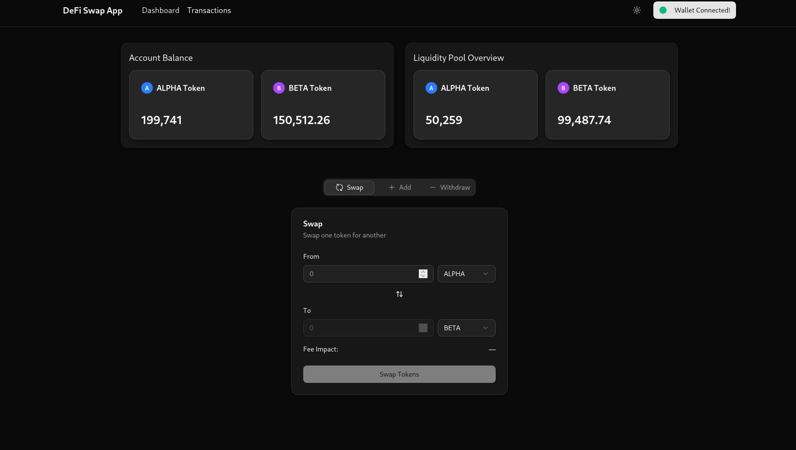
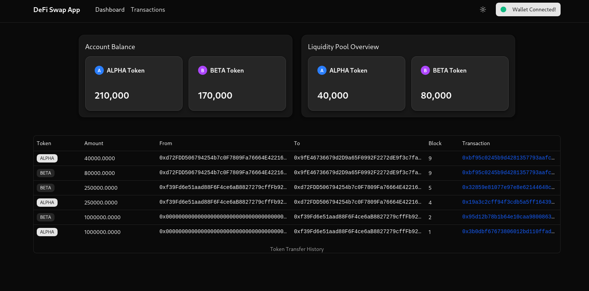

# DeFi Swap App

## Guide on setting up the application

The app uses NodeJS verion of v22.13.1.

1. Git clone and install dependencies

```bash
git clone https://github.com/nizzal/defi-swap-app.git
cd defi-swap-app/
npm install
```

2. Configure wallet address

```js
const accounts = [
  {
    address: '0xd72FDD506794254b7c0F7809Fa76664E42216402',
    amount: '1000', // Amount in Ether
  },
]
```

Above are the two metamask wallet account address. Please replace with you existing metamask wallet.

3. Start the local Hardhat network

```bash
npx hardhat node
```

4. Deploy the smart contracts

```bash
./deploy.sh
```

or use the command

```bash
npx hardhat run scripts/deploy.js --network localhost
npx hardhat run scripts/transferALPHA.js --network localhost
npx hardhat run scripts/transferBETA.js --network localhost
npx hardhat run scripts/transferDF.js --network localhost
```

5. Install dependencies and start the frontend app

```bash
cd frontend/
npm install

npm run dev
```

Visit `http://localhost:5173` to access frontend.

6. Import tokens address into metamask wallet from `frontend/src/utils/deployed-addresses.json` file.

```js
{
  "token0": "0x5FbDB2315678afecb367f032d93F642f64180aa3",
  "token1": "0xe7f1725E7734CE288F8367e1Bb143E90bb3F0512",
  "pool": "0x9fE46736679d2D9a65F0992F2272dE9f3c7fa6e0"
}
```

## Application Overview

- User can perform swap between the pair of tokens, add liquidity to the pools and withdraw tokens from the liquidity.
- Users can see all the transactions related to swap by navigating to the transactions tab from navbar




